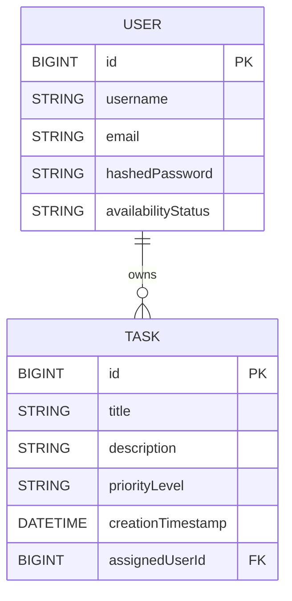

# Task Management Web App — Backend

A Spring Boot–based backend for a full-stack **Task Management Web Application**, built as part of university Full-Stack Development Labs.  
This backend provides RESTful APIs for managing users, tasks, and authentication with JWT security.

---

## Project Overview

This project serves as the **backend foundation (Lab 1)** of the Task Management Web App.  
It handles:
- User and Task management via JPA and Hibernate
- REST APIs for CRUD operations
- Automatic task assignment to available users
- JWT-based authentication and authorization
- Unit testing with JUnit and MockMvc (80%+ coverage)

---

## Tech Stack

| Layer | Technology |
|--------|-------------|
| Language | Java 17 |
| Framework | Spring Boot 3 |
| Build Tool | Maven |
| Database | MySQL |
| ORM | JPA / Hibernate |
| Security | Spring Security + JWT |
| Testing | JUnit 5, MockMvc |
| IDE | IntelliJ IDEA |

---

## Entity-Relationship Diagram (ERD)


### (This ER diagram shows a one-to-many relationship between User and Task — each user can own multiple tasks.)

## Lab 1 Structure

### Task 1: Project Setup & Health Check

* Initialized Spring Boot project.
* Added basic logging and `/health` endpoint to check DB connectivity.

### Task 2: Database Modeling

* Implemented JPA entities: User and Task.
* Added one-to-many relationship (User → Tasks) with cascade delete.
* Created repositories with custom queries and sample data initializer.

### Task 3: REST APIs

* Developed CRUD endpoints for `/api/users` and `/api/tasks`.
* Added filtering (by priority, assignee).
* Implemented `/api/tasks/assign/{id}` for automatic task assignment.
* Added DTOs and global exception handling.

### Task 4: Security and Testing

* Integrated Spring Security with JWT-based authentication.
* Added `/api/auth/register` and `/api/auth/login`.
* Secured endpoints for authorized access only.
* Wrote 5+ unit and integration tests (80% coverage).

## Setup & Run Instructions

### 1. Clone the repository

```
git clone https://github.com/<your-username>/task-management-web-app.git
cd task-management-web-app
```

### 2. Set up MySQL

Create a database in MySQL:

```sql
CREATE DATABASE taskdb;
```

Update your `application.properties` file:

```properties
spring.datasource.url=jdbc:mysql://localhost:3306/taskdb
spring.datasource.username=root
spring.datasource.password=yourpassword
spring.jpa.hibernate.ddl-auto=update
spring.jpa.show-sql=true
```

### 3. Run the backend

```
mvn spring-boot:run
```

The app will start at: [http://localhost:8080](http://localhost:8080)

## Example API Usage

### Register User

**POST** `/api/auth/register`

```json
{
  "username": "john",
  "email": "john@mail.com",
  "password": "12345678"
}
```

### Login

**POST** `/api/auth/login`

```json
{
  "email": "john@mail.com",
  "password": "12345678"
}
```

→ Returns JWT token:

```json
{"token": "eyJhbGciOiJIUzI1NiJ9..."}
```

### Create Task (Authorized)

**POST** `/api/tasks`
Headers: `Authorization: Bearer <token>`

```json
{
  "title": "Prepare report",
  "description": "Weekly progress summary",
  "priorityLevel": "HIGH"
}
```

## Branching Strategy

* Main branch: `main`
* Lab 1 backend branch: `lab-1-backend`
* Future labs:

    * `lab-2-frontend`
    * `lab-3-integration`

**Merge workflow:**

1. Develop on feature branch.
2. Push commits.
3. Open Pull Request titled: `"Lab 1: Backend Foundation Complete"`
4. Use **Squash and Merge** for clean history.

## Author

**Dana Bakhtybay**
IT2-2201, IITU
GitHub: [@verdenhaus](https://github.com/verdenhaus)

